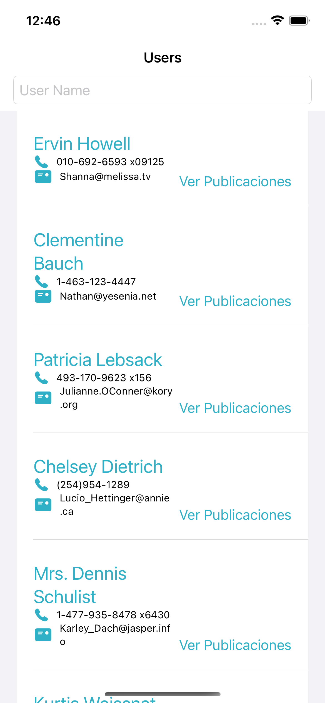
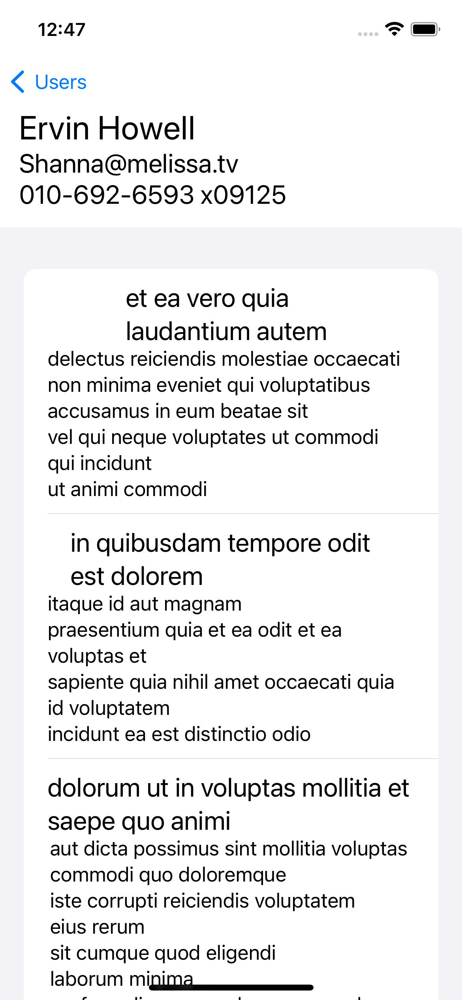

#  JsonPlaceholder-iOS

This is an iOS client for the JsonPlaceholder api (https://jsonplaceholder.typicode.com)

## Architecture

I choosed viper for two reasons, the first one is to practice viper with SwiftUI, I usually use viper on UIKit projects, and the second is that viper, despite not being the best option to do a technical test, is a great option to show more complex interactions between classes and have more opportunity to develop good practices.

Normally I would choose MVVM, it works great with SwiftUI.

## Libraries

SwiftUI
CoreData
Combine
Alamofire

SwiftUI is my favorite way to develop iOS applications, but, it is not compatible with every device and you have to take into account wich device your users have before choosing it over UIKit.

This was my first time using CoreData, it was a little bit hard to understand at first, but with some help from [this](https://www.adictosaltrabajo.com/2020/05/26/arquitectura-viper-en-swiftui/) blog I was able to develop some functiona code, I have to improve that.

SwiftUI has Combine built in, so using it is easier than using it in UIKit.

## Testing

I am not good at testing application with a low ammount of business logic on the client, I know I can do some UI testing and implement some dependency injection along side with mocking to do Unit testing, but I just do not see where should I do unit tests. 

## Screenshots

